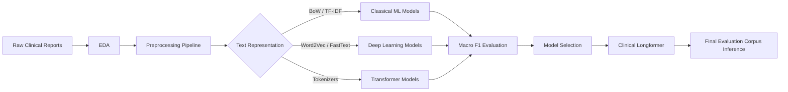

# 🧬 Cancer Staging NLP — TNM T-Stage Classification


> **End-to-end Natural Language Processing pipeline for automatic cancer staging from clinical pathology reports.**

This project explores the automatic classification of the **T component of the TNM cancer staging system** using clinical text reports. The objective is to predict one of four possible labels — **T1, T2, T3 or T4** — from unstructured medical reports, comparing traditional Machine Learning, Deep Learning architectures and state-of-the-art Transformer models adapted to biomedical language.

The final system uses **Clinical Longformer** to handle long clinical documents and achieves a final **Macro F1-Score of 0.8313** on the evaluation corpus.

---

## 💡 Project Overview

Cancer staging is a critical step in clinical decision-making, as it helps specialists estimate tumour extent and choose an appropriate treatment strategy. In particular, the **T stage** describes the size and extension of the primary tumour.

Manual staging requires expert interpretation of pathology reports. This project investigates how NLP systems can assist this process by transforming raw clinical text into structured predictions.

**Key Technical Capabilities:**

* **🧾 Clinical Text Classification:** Automatic prediction of TNM T-stage labels from pathology reports.
* **🧹 NLP Preprocessing Pipeline:** Lowercasing, punctuation removal, stopword filtering, lemmatization and POS-based filtering.
* **📊 Classical ML Benchmarking:** Comparison of BoW, TF-IDF, Word2Vec, FastText, BERT and ELMo embeddings with Naive Bayes, Logistic Regression and Linear SVM.
* **🧠 Deep Learning Models:** Evaluation of CNN, SimpleRNN, LSTM and BiLSTM architectures over sequential text representations.
* **🤗 Transformer Fine-Tuning:** Experiments with BERT, BioBERT and Clinical Longformer for biomedical document classification.
* **🔁 Data Augmentation:** Class-balancing strategies using synonym replacement and back-translation for underrepresented stages.

---

## 📊 Dataset

The project uses an English-language clinical dataset composed of **5,158 anonymized medical reports**. Each instance contains:

| Field        | Description                                     |
| ------------ | ----------------------------------------------- |
| `patient_id` | Anonymized patient identifier                   |
| `text`       | Clinical pathology report                       |
| `t`          | Target label to predict: `T1`, `T2`, `T3`, `T4` |

### Exploratory Data Analysis

The EDA highlighted two main challenges:

* **Class imbalance:** `T2` and `T3` appear much more frequently than `T4`, while `T1` also presents moderate imbalance.
* **Long document variability:** Reports range from fewer than 50 words to more than 3,500 words, creating a trade-off between preserving context and avoiding excessive padding.

These findings motivated the use of both **class weighting** and **long-context Transformer architectures**.

---

## 🏗️ System Architecture

The complete workflow covers data ingestion, preprocessing, representation learning, experimentation and final inference.



---

## 🧪 Experiments & Results

The project follows a progressive experimentation strategy, starting from simple baselines and advancing toward domain-specific Transformers.

### 1. Baseline System

The initial baseline predicts the most frequent class in the training set.

| Model                   | Strategy            | Macro F1  |
| ----------------------- | ------------------- | --------- |
| Majority Class Baseline | Most frequent label | **0.127** |

This result establishes the minimum reference point for the rest of the experiments.

---

### 2. Classical Machine Learning

Several combinations of preprocessing strategies, vectorizers and classifiers were evaluated.

**Best classical configuration:**

| Component     | Best choice            |
| ------------- | ---------------------- |
| Preprocessing | Lemmatized text        |
| Vectorization | Character-level TF-IDF |
| Classifier    | Linear SVM             |
| Macro F1      | **0.747**              |

Character-level TF-IDF performed especially well because it captures internal word patterns, abbreviations and morphological variants common in clinical reports.

---

### 3. Deep Learning Models

Four neural architectures were tested: **CNN**, **SimpleRNN**, **LSTM** and **BiLSTM**.

| Model         | Best Configuration                                   | Macro F1  |
| ------------- | ---------------------------------------------------- | --------- |
| **CNN**       | Trainable embeddings + class weights                 | **~0.75** |
| **SimpleRNN** | Augmented dataset + frequency/TF-IDF/binary features | **~0.48** |
| **LSTM**      | Augmented dataset + Word2Vec                         | **~0.57** |
| **BiLSTM**    | Augmented dataset + FastText                         | **~0.58** |

The CNN achieved the best deep learning performance, suggesting that **local clinical patterns** are highly informative for T-stage classification.

---

### 4. Transformer Fine-Tuning

Transformer-based models were evaluated to exploit contextualized language representations.

| Model                   | Domain                  | Main Limitation           | Outcome                              |
| ----------------------- | ----------------------- | ------------------------- | ------------------------------------ |
| **BERT**                | General language        | 512-token limit           | Strong but constrained by truncation |
| **BioBERT**             | Biomedical text         | 512-token limit           | More stable on clinical text         |
| **Clinical Longformer** | Long clinical sequences | Higher computational cost | Best overall performance             |

BERT and BioBERT performed strongly but were limited by the maximum input length of **512 tokens**, which caused loss of context in long reports. Clinical Longformer addressed this limitation through local attention windows and longer input sequences.

---

### 5. Data Augmentation

To mitigate imbalance, targeted augmentation was applied:

| Target subset      | Augmentation strategy                  |
| ------------------ | -------------------------------------- |
| `T1` short reports | Synonym replacement                    |
| `T4` reports       | Back-translation + synonym replacement |

For `T4`, the number of samples increased from **521 to 1,563**, improving class coverage and reducing the risk of model memorization.

---

## 🏆 Final Results

The final selected model was **Clinical Longformer**, used in the final pipeline for inference over the evaluation corpus.

| Final Model             | Context Length          | Final Macro F1 |
| ----------------------- | ----------------------- | -------------- |
| **Clinical Longformer** | Long clinical sequences | **0.8313**     |

This result demonstrates solid generalization and confirms the value of long-context biomedical Transformers for clinical document classification.

---

## 🛠️ Tech Stack

* **Language:** Python
* **Package Manager:** uv
* **Classical ML:** scikit-learn
* **Deep Learning:** PyTorch, TensorFlow / Keras
* **Transformers:** Hugging Face Transformers
* **Embeddings:** Word2Vec, FastText, BERT, ELMo
* **Data Processing:** Pandas, NumPy
* **Visualization:** Matplotlib, Seaborn
* **Experimentation:** Jupyter Notebooks

---

## 📁 Project Structure

```text
.
├── Code/
│   ├── base_line.py
│   ├── ml_models.py
│   ├── preproc.py
│   └── vectorize.py
│
├── Data/
│   ├── raw/
│   │   └── tcga_simple_train.csv
│   └── interim/
│       ├── tcga_simple_train_preprocessed_3.csv
│       └── tcga_simple_train_preprocessed_3_augmented.csv
│
├── Models/
│   └── trained models and checkpoints
│
├── Notebooks/
│   ├── README.ipynb
│   ├── 01_EDA.ipynb
│   ├── 02_base_line.ipynb
│   ├── 03_preprocessing.ipynb
│   ├── 04_text_vectorization.ipynb
│   ├── 05_contextual_embeddings_bert_elmo.ipynb
│   ├── 06_ML_models.ipynb
│   ├── 07_CNN.ipynb
│   ├── 08_RNN.ipynb
│   ├── 09_LSTM.ipynb
│   ├── 10_Bi-LSTM.ipynb
│   ├── 11_BERT_Classification.ipynb
│   ├── 12_BioBERT_Classification.ipynb
│   ├── 13_DataAugmentation.ipynb
│   ├── 14_Longformers.ipynb
│   └── 16_Pipeline_Final.ipynb
│
├── Results/
│   ├── Metrics/
│   │   ├── bert_results.csv
│   │   ├── bi_lstm.csv
│   │   ├── biobert_results.csv
│   │   ├── clinicalLongformer_results.csv
│   │   └── lstm.csv
│   └── Outputs/
│       └── inferred datasets
│
├── pyproject.toml
└── uv.lock
```

---

## 🚀 Installation & Usage

### 1. Clone the repository

```bash
git clone https://github.com/<your-user>/<your-repository>.git
cd <your-repository>
```

### 2. Install dependencies with uv

```bash
uv sync
```

Alternatively, install dependencies manually:

```bash
pip install pandas numpy scikit-learn matplotlib seaborn torch tensorflow transformers gensim spacy
```

### 3. Run the notebooks

The project is organized as a reproducible experimental pipeline:

1. **`01_EDA.ipynb`** — Exploratory analysis of class distribution, text length and vocabulary patterns.
2. **`03_preprocessing.ipynb`** — Text cleaning and preprocessing strategies.
3. **`04_text_vectorization.ipynb`** — BoW, TF-IDF and embedding generation.
4. **`06_ML_models.ipynb`** — Classical ML benchmarking.
5. **`07_CNN.ipynb` – `10_Bi-LSTM.ipynb`** — Deep Learning experiments.
6. **`11_BERT_Classification.ipynb`** — Fine-tuning BERT.
7. **`12_BioBERT_Classification.ipynb`** — Fine-tuning biomedical BERT.
8. **`14_Longformers.ipynb`** — Long-context Transformer experiments.
9. **`16_Pipeline_Final.ipynb`** — Final inference pipeline.

---

## 🔬 Key Learnings

* Classical ML models remain highly competitive for clinical text classification when paired with strong TF-IDF representations.
* CNNs can outperform recurrent models by detecting local textual patterns associated with tumour staging.
* BERT-based models are powerful but limited by their 512-token context window.
* Clinical Longformer is better suited for long medical reports, although it requires significantly more computational resources.
* Data augmentation improves representation of minority classes, especially in underrepresented cancer stages.

---

## 🔮 Future Work

* Apply **LoRA** or other parameter-efficient fine-tuning methods to reduce the cost of Longformer experimentation.
* Expand the experimentation grid across preprocessing methods and neural architectures.
* Evaluate explainability methods to identify which clinical phrases influence each prediction.
* Extend the pipeline from T-stage prediction to full **TNM staging**.
* Add automated experiment tracking with tools such as MLflow or Weights & Biases.

---

## 👨‍💻 Authors

**Hugo Salvador Aizpún**

**Tomás Cano Santa Catalina**

*Natural Language Processing · Clinical AI · Biomedical Text Classification*

---

## 📚 References

This project is based on concepts from:

* Vaswani et al. — *Attention Is All You Need*
* Devlin et al. — *BERT: Pre-training of Deep Bidirectional Transformers for Language Understanding*
* Lee et al. — *BioBERT: a pre-trained biomedical language representation model for biomedical text mining*
* Li et al. — *Clinical-Longformer and Clinical-BigBird: Transformers for long clinical sequences*
